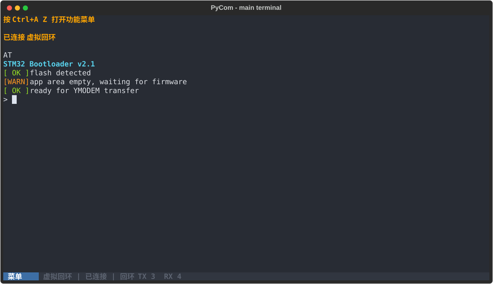
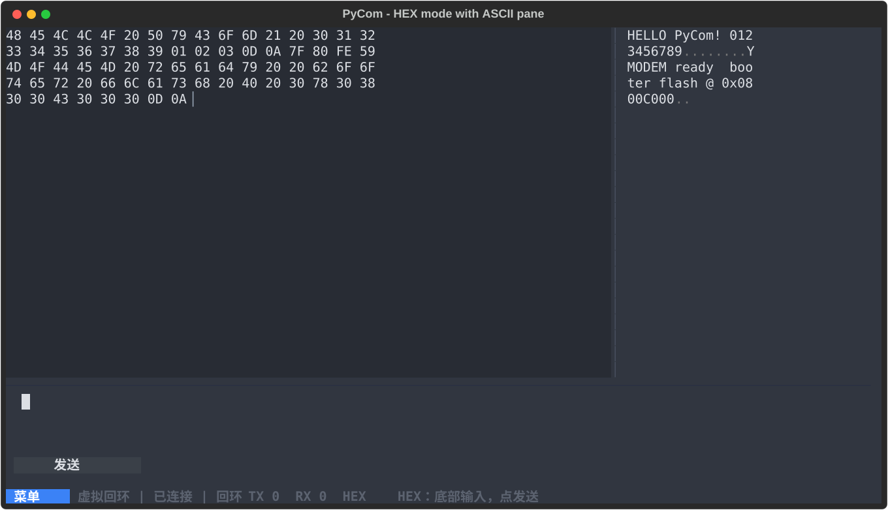
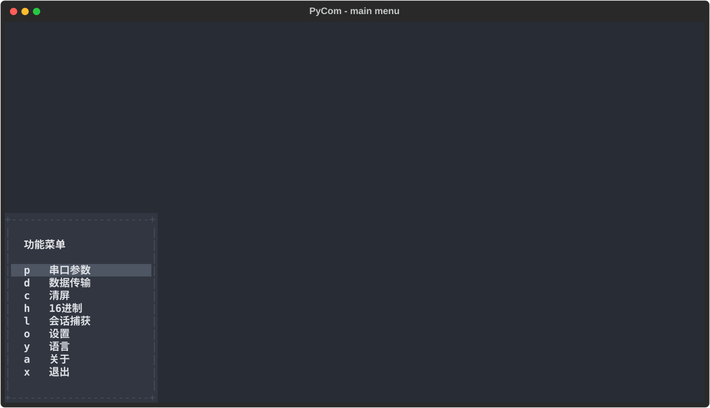
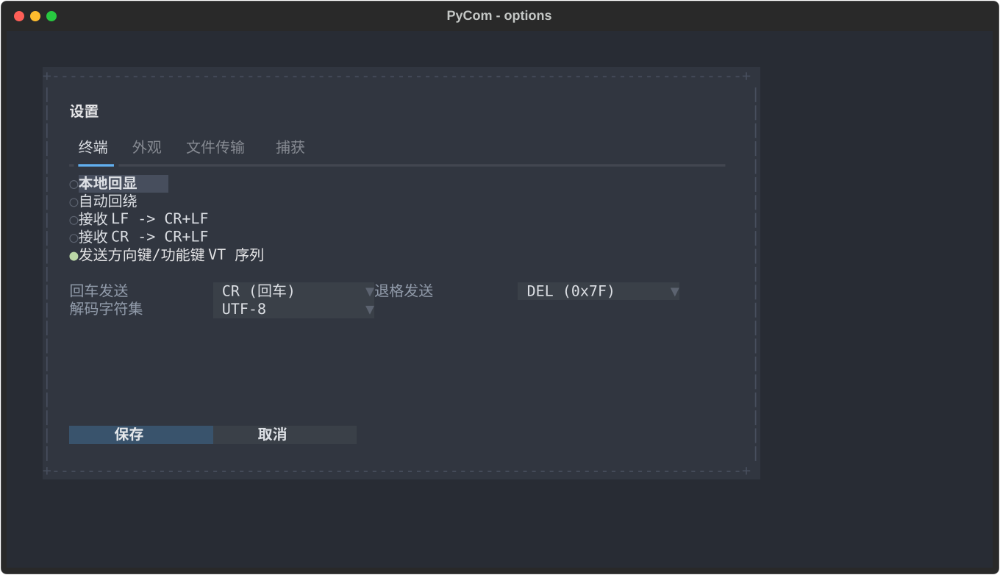

<div align="center">

# PyCom

**minicom 风格的跨平台串口终端 TUI，内置健壮的 YMODEM 文件传输。**

面向嵌入式固件烧录（STM32 等 ymodem bootloader）与日常串口调试。

[English](README.md) · [简体中文](#)

</div>

<p align="center">
  <a href="https://github.com/greyskysoul/pycom/actions/workflows/ci.yml"></a>
  <a href="https://pypi.org/project/pycom/"></a>
  <a href="https://pypi.org/project/pycom/"></a>
  <a href="LICENSE"></a>
  <a href="https://github.com/greyskysoul/pycom/releases"></a>
  <a href="https://github.com/greyskysoul/pycom/stargazers"></a>
</p>

## 界面预览

<p align="center">
  
  <br><sub>主界面 — 设备 ANSI/VT 输出、滚动回看与实时 TX/RX 计数</sub>
</p>

<p align="center">
  
  <br><sub>HEX 模式 — 左侧十六进制字节，右侧分栏显示可打印 ASCII（其余为灰色圆点）</sub>
</p>

<p align="center">
  
  
  <br><sub>Ctrl+A 功能菜单弹层与设置</sub>
</p>

## 特性

- **全屏终端界面**：设备 ANSI/VT 输出正确渲染、可滚动回看。
- **浅色/深色主题**：One Half 配色，可在选项页切换；“自动”模式跟随终端背景（OSC 11）或系统主题。
- **Ctrl+A 前缀键 + 弹层菜单**（minicom 交互习惯）。
- **YMODEM 发送 / 接收**：CRC-16-CCITT、128/1024 字节块可配置、超时重传、进度显示、可取消。
- **ZMODEM 传输**：与 lrzsz 兼容的协议引擎（通过 `Ctrl+A` `S`/`R` 选择）。
- 端口/波特率等参数随时可改、配置持久化。
- 会话捕获（log）、本地回显、行尾转换、HEX 显示等选项。
- 弹层（菜单 / 连接 / 选项 / 确认对话框）自动适配小窗口（紧凑整屏布局）。
- 窗口小到完全无法使用时（< 20 列或 < 5 行）直接打印提示并退出，不进入残破界面。
- `--bare` 无界面纯串口直通：stdin→串口、串口 RX→stdout，供 AI agent 等外部进程驱动。
- Windows（建议 Windows Terminal）与 Linux 双平台。

## 安装

```bash
python -m venv .venv
# Windows
.venv\Scripts\activate
# Linux
source .venv/bin/activate
pip install -e ".[dev]"
```

或从 PyPI 安装：

```bash
pip install pycom
```

## 运行

```bash
pycom                          # 启动后按 Ctrl+A Z 打开菜单 / 自动弹出连接对话框
pycom --port COM3 --baud 115200
pycom /dev/ttyUSB0 -b 921600
# 连接后直接发送字符串（支持 \n \r \t \xHH 等转义）
pycom -p COM3 -s "AT\r"
# 连接后逐行发送脚本文件（# 开头为注释行）
pycom -p COM3 -f boot.txt
# 连续 5 秒未收到任何字节则自动退出（-e 支持小数秒）
pycom -p COM3 -s "AT\r" -e 5
# 启动后自动开启 16 进制接收/发送模式（HEX）
pycom -p COM3 --hex
# 关闭鼠标捕获（滚轮/点击交给宿主终端自身处理）
pycom -p COM3 --no-mouse
# 兼容模式：适配 Linux 虚拟控制台（init3）等极端环境
# 强制英文、16 色、关动画、关鼠标
pycom -p /dev/ttyUSB0 --compat
# 本次运行强制界面语言（zh | en），也可用环境变量 PYCOM_LANG=...
pycom --lang en
# 无界面纯串口直通（--bare）：隐藏全部界面，必须指定端口。
# stdin 字节→串口发送，串口 RX 原样打到 stdout，适合把终端交给 AI agent 等进程：
pycom --bare -p COM3 -b 115200
```

> 移除 `-d/-s/-f` 缩写：数据位/停止位/流控请用全称 `--data-bits`/`--stop-bits`/`--flow`；
> `-s`/`-f` 已改作“启动后发送字符串/脚本”，需配合 `-p/--port`。
>
> `--bare` 为隐藏全部界面的纯直通模式：只使用连接参数（`-p/-b/--parity/...`），
> 不能与 `-s/-f/-e/--hex` 等交互启动选项混用。
>
> **极端环境（Linux `init3` / 裸虚拟控制台）**：Linux 虚拟控制台（`TERM=linux`）只支持
> 8/16 色、字体没有中文字形、也没有鼠标上报，富界面会显示乱码。程序检测到后会自动
> 进入**兼容模式**：英文界面、专属高对比 ANSI 主题（只用基础 8 色——Linux 控制台
> 不支持亮色背景，否则控件会没有底色）、关动画、关鼠标。可用 `--compat`
> 手动强制，或用 `--no-compat` 关闭自动检测。`--lang en`（或环境变量 `PYCOM_LANG=en`）
> 可只对本次运行强制语言，不改动已保存的偏好。也可自行用 Textual 的环境变量降级：
> `TEXTUAL_COLOR_SYSTEM=standard`、`TEXTUAL_ANIMATIONS=none`、`NO_COLOR=1`（后者会连
> 设备的 ANSI 颜色一并去掉）。兼容模式下复选框/单选项标记会退化为 ASCII `[ ]`/`[x]`，
> 下拉框/折叠标题箭头退化为 `v`/`^`/`>`，因为控制台字体通常缺少 `○`/`●`/`▼`/`▲`/`▶` 字形。

## 快捷键（Ctrl+A 前缀）

| 按键 | 功能 |
| ---------- | ------------------------------- |
| `Ctrl+A` `Z` | 打开主菜单（浮动弹层） |
| `Ctrl+A` `P` | 串口参数（连接设置） |
| `Ctrl+A` `S` | 发送文件（先选择 YMODEM/ZMODEM） |
| `Ctrl+A` `R` | 接收文件（先选择 YMODEM/ZMODEM） |
| `Ctrl+A` `L` | 会话捕获开关 |
| `Ctrl+A` `C` | 清屏 |
| `Ctrl+A` `H` | 16 进制接收/发送（HEX）开关 |
| `Ctrl+A` `O` | 选项 |
| `Ctrl+A` `Y` | 语言 |
| `Ctrl+A` `A` | 关于 |
| `Ctrl+A` `X` | 退出 |
| `Esc`（前缀中） | 取消前缀 |

> 本地回显、自动回绕等开关集中在 `Ctrl+A` `O` 的选项弹层中设置（默认关闭），
> 不再占用前缀快捷键。
>
> **HEX 模式**（`Ctrl+A H`，可持久化）：收到的字节以十六进制文本显示在左侧，
> 右侧分栏显示 ASCII —— 可打印字符原样显示，其余为灰色圆点；底部出现多行
> 16 进制输入区（只接受合法字符，自动按字节加空格，并按窗口宽度每行排 4/8/16/32
> 字节）。主界面按键不再直接发送——在输入区按 `Enter`（或点击底部“发送”按钮）
> 即可把输入解析为字节发出；用快捷键开启后会自动聚焦输入区。
>
> **鼠标捕获**默认开启（滚动回看与应用内选中需要它）；用 `--no-mouse` 启动则把
> 滚轮/点击交还给宿主终端。
>
> **虚拟回环设备**（调试）：用 `--enable-debug` 启动后，`Ctrl+A P` 连接页端口列表
> 末尾会出现 `LOOPBACK`，无需真实串口，所有发送的字节会原样回显（纯回环），
> 适合在没有硬件时调试收发与 HEX 显示。

## 开发

```bash
python tools/check.py   # 提交前检查：ruff / 格式 / mypy / 单元测试
```

该命令与 CI 测试 job 使用相同的检查入口；所有检查通过后再提交。

结构：`src/pycom/`（`serialio.py` 串口、`termdisplay/` 终端渲染、`xfer/ymodem.py`
协议引擎、`screens/` 各界面、`keys.py` 按键状态机、`app.py` 主程序）。

## 打包

```bash
pip install pyinstaller
pyinstaller packaging/pycom.spec    # 得到 onedir 目录 dist/pycom/（体积优化）
```

体积优化（`packaging/pycom.spec` 已内置）：

- **onedir 布局**：避免 onefile 每次启动自解压的开销，便于在嵌入式设备上检查/删除未使用的运行时文件
- **排除 ssl/网络模块**：串口终端不用 SSL，省约 6MB（libcrypto/libssl）
- **排除未使用的 Textual 组件**与 stdlib 扩展模块（`_decimal`/`_lzma`/`_bz2`/`_zstd` 等）
- **strip + UPX**：Linux 与 Python 3.12 下生效；Windows + Python 3.14 因二进制启用 CFG 自动跳过 UPX

CI（`.github/workflows/ci.yml`）在 Windows / Ubuntu 双平台跑 lint/类型/测试并构建产物
（CI 会自动安装 UPX）。推送 `v*` 标签（如 `v0.1.0`）时自动用构建产物创建 GitHub Release。

## 技术栈

- **Python ≥3.9**，`src` 布局，标准库优先
- **Textual** — 终端 TUI 框架（模态弹层/表单/文件树，天然支持弹层菜单）
- **pyserial** — 串口（含 `list_ports` 端口枚举）
- **pyte** — 设备 RX 字节流的 VT 终端模拟（子类化其 `Screen` 捕获滚出内容实现回看；LGPLv3）
- **自研 YMODEM 引擎**（`xfer/ymodem.py`）：CRC-16-CCITT、SOH/STX、128/1024 块、
  超时/重传可配置、重复块容忍、CAN-CAN 中止、坏块自动重传、进度回调
- **自研 ZMODEM 引擎**（`xfer/zmodem.py`）：ZRQINIT/ZRINIT/ZFILE/ZDATA 握手、
  十六进制控制帧 + 二进制数据子包（ZCRCW/ZACK）、单文件会话
- 打包：PyInstaller；测试：pytest（含 Textual Pilot 无头 UI 测试）、ruff、mypy

## 目录结构

```txt
src/pycom/
  app.py              主程序（Ctrl+A 前缀状态机、串口路由、传输 worker、捕获）
  config.py           配置数据模型 + JSON 持久化
  serialio.py         串口层（后台读线程、写锁、端口枚举、热拔插）
  keys.py             按键→字节映射（行尾/退格/方向键 VT 序列…）
  termdisplay/
    vt.py             pyte 终端模型（解码、滚动历史、resize）
    view.py           TerminalView / StatusBar 控件
  xfer/ymodem.py      YMODEM 双向协议引擎（纯 Python、可脱离串口单测）
  xfer/zmodem.py      ZMODEM 传输引擎（纯 Python、可脱离串口单测）
  screens/            连接、主菜单、选项、文件/目录选择、收发传输界面
  resources/app.tcss  主题
tests/unit/           CRC/帧/block0、引擎回环(含错误注入)、按键、终端模型、Pilot UI
packaging/            PyInstaller 启动器与 spec
```

## 配置

配置文件为 JSON（`%APPDATA%\pycom\config.json` Windows /
`~/.config/pycom/config.json` Linux），可通过 Ctrl+A O 修改并在运行中保存。

## 已知范围（Roadmap）

- v1 已含：YMODEM 双向收发、ZMODEM 传输、捕获日志、行尾/回显/解码/流控配置、滚动回看、HEX 渲染
- v1 不含：XMODEM/Kermit、ASCII 发送、宏脚本、拨号目录、分屏多会话
- 建议在 **Windows Terminal** 下运行（完整支持 ConPTY/颜色）

## 实测建议

1. Linux 与 lrzsz 交叉验证：`sz -Y file` 对 PyCom 接收；`rz -Y` 对 PyCom 发送
2. ZMODEM：用 lrzsz 的 `rz` 接收 PyCom 通过 `Ctrl+A` `S`（选 ZMODEM）发送的文件
3. Windows/Linux 双端可用 socat(pty)/com0com 虚拟串口做端到端回环
4. STM32 bootloader 实机烧录建议 115200/921600 各验证一次大文件（SHA256 比对）

## AI 声明

本项目在开发过程中使用了 AI 编程助手（GitHub Copilot）辅助编写、审查与调试代码。
所有代码均经过人工复核与自动化测试（pytest / ruff / mypy）验证。
